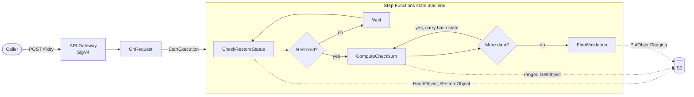
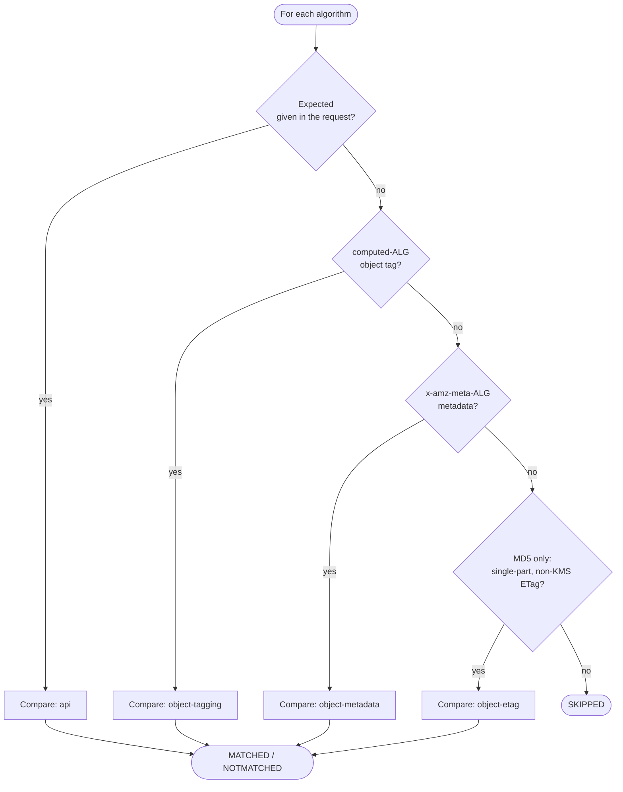

# Serverless Fixity for Digital Preservation Compliance

Compute and verify checksums for Amazon S3 objects of any size, including
objects that live in Glacier and have to be thawed first.

Fixity checking is the routine confirmation that an archived file is still
bit-for-bit what it was when it was ingested. The hard part on S3 is that a
preservation master can be far larger than a single Lambda invocation can read,
so this solution drives the work from a Step Functions state machine: it reads
the object one range at a time and carries the partially advanced hash state
from one invocation to the next until the whole object has been consumed.

**MD5, SHA-1 and SHA-256 are computed in a single pass.** Ask for all three and
the object is still read exactly once, because every byte is handed to every
hash before the next range is fetched. Egress and time scale with the object,
not with the number of algorithms.

## How it works



| State | What it does |
| --- | --- |
| `CheckRestoreStatus` | Pins the object's ETag and size so a mid-run overwrite is caught. If the object is archived, requests a restore and sizes the poll interval from the storage class and retrieval tier. |
| `ComputeChecksum` | Reads one byte range and advances every requested hash. Loops until the object is exhausted, suspending its hash state whenever the invocation deadline nears. |
| `FinalValidation` | Compares each digest against a known reference and records the results as object tags. |

### Hashing across invocations

A Lambda invocation lasts at most 15 minutes, so a large object needs several.
That rules out `node:crypto` for the general case: its `Hash` objects cannot be
serialized, only cloned in-process. This repo therefore carries small,
dependency-free MD5, SHA-1 and SHA-256 implementations whose mid-stream state
serializes to a compact token (about 100 bytes) that rides along in the Step
Functions payload.

Objects small enough to finish in one invocation take a fast path through
`node:crypto` instead, which is roughly ten times quicker. `SinglePassLimitBytes`
sets that threshold (8 GiB by default). If a single-pass attempt does run out of
time, the function reports no progress and pins the retry to the resumable
implementation rather than failing the run.

The portable implementations are checked against `node:crypto` in
`tests/hash.test.mjs`: exact agreement across block-size boundaries, ragged
chunk splits, and repeated serialize/deserialize cycles at every offset.

### Finding something to compare against

`FinalValidation` judges each algorithm on its own, taking the first reference
it can find:



An ETag is only the object's MD5 for single-part uploads that were not
encrypted with KMS, so it is used only for MD5 and only when the ETag looks
like a plain 32-character digest. The run's overall `ComparedResult` is the
worst of the per-algorithm verdicts: one `NOTMATCHED` fails the whole run.

Matching digests are written back as `computed-<algorithm>` tags alongside a
`computed-<algorithm>-last-modified` timestamp, so the next run has a reference
to compare against. A digest that failed its comparison is deliberately *not*
recorded. S3 allows ten tags per object; if there is no room, the comparison is
still reported and the shortfall is logged.

## Deploying

Requires the [AWS SAM CLI](https://docs.aws.amazon.com/serverless-application-model/latest/developerguide/install-sam-cli.html)
and Node.js 24 or newer.

```bash
sam build && sam deploy --guided
```

`--guided` walks through the parameters once and writes them to
`samconfig.toml`; after that, `sam deploy` is enough. To iterate on the Lambda
code without a full deploy, use `sam sync`.

If your infrastructure already lives in Terraform, [terraform/](terraform) is a
module that deploys the same resources and can be called from an existing
configuration:

```hcl
module "fixity" {
  source          = "github.com/nulib/serverless-fixity//terraform"
  name            = "preservation-fixity"
  content_buckets = ["my-preservation-masters"]
}
```

### Parameters

| Parameter | Default | Notes |
| --- | --- | --- |
| `ContentBucketList` | `*` | Comma-separated bucket names the solution may read. Narrow this to the buckets you actually check. |
| `AllowOrigins` | `*` | Origin allowed by the function URL's CORS configuration. |
| `ComputeChecksumMemorySize` | `3008` | Memory buys proportional CPU and network, so raising this shortens runs. |
| `SinglePassLimitBytes` | `8589934592` | Objects at or below this size take the `node:crypto` fast path. |
| `LambdaArchitecture` | `arm64` | No native dependencies, so either architecture works. |
| `LogRetentionInDays` | `30` | |

The stack outputs `ApiEndpoint` -- the function URL -- and `StateMachineArn`.

Callers sign requests with SigV4 and need `lambda:InvokeFunctionUrl` on the
`OnRequest` function. CORS is handled by the function URL itself, so the
handler returns no `Access-Control-*` headers of its own.

## Using it

### Start a run

The function URL uses `AWS_IAM` auth, so requests are signed for the `lambda`
service and the caller needs `lambda:InvokeFunctionUrl` on the `OnRequest`
function.

```bash
curl -X POST "$API_ENDPOINT" \
  --aws-sigv4 "aws:amz:$AWS_REGION:lambda" \
  --user "$AWS_ACCESS_KEY_ID:$AWS_SECRET_ACCESS_KEY" \
  -H "x-amz-security-token: $AWS_SESSION_TOKEN" \
  -H 'Content-Type: application/json' \
  -d '{
        "Bucket": "my-preservation-bucket",
        "Key": "masters/reel-1.mov",
        "Algorithms": ["md5", "sha256"]
      }'
```

Or skip the endpoint and start the state machine directly:

```bash
aws stepfunctions start-execution \
  --state-machine-arn "$STATE_MACHINE_ARN" \
  --input '{"Bucket":"my-preservation-bucket","Key":"masters/reel-1.mov","Algorithms":["md5","sha256"]}'
```

#### Request fields

| Field | Required | Notes |
| --- | --- | --- |
| `Bucket`, `Key` | yes | The object to check. |
| `Algorithms` | no | Any of `md5`, `sha1`, `sha256`. Defaults to `["md5"]`. `Algorithm: "md5"` is also accepted. |
| `Expected` | no | Reference digests as `{"md5": "<hex>"}`. A bare hex string works when exactly one algorithm was requested. |
| `StoreChecksumOnTagging` | no | Set `false` to compare without writing tags. Defaults to `true`. |
| `ChunkSize` | no | Ceiling on bytes requested per invocation. The invocation deadline usually cuts a range short first. |
| `RestoreRequest` | no | `{"Days": 1, "Tier": "Bulk"}`. `Tier` is one of `Standard`, `Bulk`, `Expedited`. |

### Check on a run

```bash
curl -G "$API_ENDPOINT" --data-urlencode "executionArn=$EXECUTION_ARN" \
  --aws-sigv4 "aws:amz:$AWS_REGION:lambda" \
  --user "$AWS_ACCESS_KEY_ID:$AWS_SECRET_ACCESS_KEY" \
  -H "x-amz-security-token: $AWS_SESSION_TOKEN"
```

The bare execution name works too; it is expanded against this deployment's own
state machine.

### Result

A completed execution's output looks like this:

```jsonc
{
  "Bucket": "my-preservation-bucket",
  "Key": "masters/reel-1.mov",
  "Algorithms": ["md5", "sha256"],
  "FileSize": 274877906944,
  "ETag": "\"6805f2cfc46c0f04559748bb039d69ae-32\"",
  "State": "FinalValidation",
  "Status": "COMPLETED",
  "Elapsed": 2841509,
  "ComparedResult": "MATCHED",
  "Checksums": {
    "md5": {
      "Computed": "6d2b0b4c3e2f...",
      "Expected": "6d2b0b4c3e2f...",
      "ComparedWith": "object-tagging",
      "ComparedResult": "MATCHED",
      "TagUpdated": true
    },
    "sha256": {
      "Computed": "9f86d081884c...",
      "ComparedWith": "none",
      "ComparedResult": "SKIPPED",
      "TagUpdated": true
    }
  }
}
```

`ComparedResult` is `MATCHED`, `NOTMATCHED`, or `SKIPPED` when there was
nothing to compare against. **A run that reports `NOTMATCHED` completes
successfully** — the state machine's job is to report the finding, not to fail
on it. Alert on the field, not on the execution status. To be notified, put an
EventBridge rule on Step Functions execution status changes, or read
`ComparedResult` from the execution output.

## Development

```bash
npm install        # lint tooling
npm test           # unit tests, no AWS calls
npm run lint
npm run validate   # sam validate --lint
npm run build      # sam build
```

This repo holds two npm packages: the root one carries the lint tooling, and
`src/` is the deployable package with the AWS SDK dependencies. The tests
import `src/`, so `npm test` installs those on first run if they are missing.
`sam build` installs them separately into each function's artifact.

The tests are plain `node:test` with no test framework, and they never touch
AWS: S3 and Step Functions are injected as fakes (`tests/helpers/fakeS3.mjs`).

```
template.yaml              one SAM template: functions, state machine, API, IAM
statemachine/fixity.asl.json
src/
  index.mjs                Lambda handlers, one per state
  lib/
    api.mjs                REST facade over the state machine
    restore.mjs            CheckRestoreStatus
    compute.mjs            ComputeChecksum
    validate.mjs           FinalValidation
    fixityState.mjs        the payload contract shared by every state
    hash/                  resumable MD5, SHA-1, SHA-256
tests/
terraform/                 the same resources as a Terraform module
tools/execution-summary.mjs  what one execution cost, per state
```

`tools/` has its own dependencies; run `npm install` inside it before using
`execution-summary.mjs`.

Layout notes:

- The three SDK clients are installed into each function's package by
  `sam build`. They are deliberately not in a Lambda layer: ESM ignores
  `NODE_PATH`, so `import` cannot resolve `/opt/nodejs/node_modules`.
- Error class names in `src/lib/errors.mjs` double as Step Functions error
  identifiers. `statemachine/fixity.asl.json` matches on them to decide what
  not to retry, so renaming one is a breaking change.

## Costs

The dominant cost is `ComputeChecksum` runtime, which is proportional to object
size, plus one state transition per range read. `ChunkSize` and
`ComputeChecksumMemorySize` are the levers: more memory means more CPU and
network, so ranges finish sooner and fewer transitions are needed.
`tools/execution-summary.mjs` reports what a given execution actually used.

Glacier restores are billed separately by S3 and dominate everything else for
archived objects. `Bulk` is the cheapest tier and the default.

## License

MIT-0. See [LICENSE.txt](LICENSE.txt).
